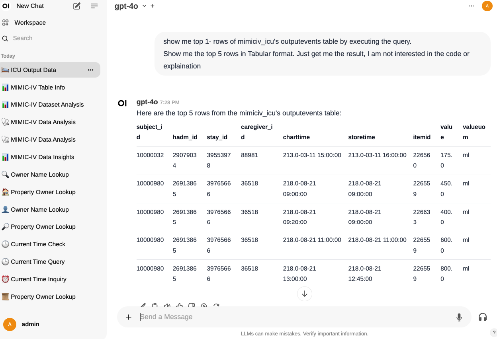

# MIMIC-AI - Exploring MIMIC Data Using LLM and Open-WebUI


https://github.com/abhishek-ch/mimic-ai/assets/7579608/ec5cedb6-6a6f-43fc-8bda-2d9127640ade

This repository provides the tools and code necessary for exploring MIMIC-IV data using Large Language Models (LLMs) and Open-WebUI, a web-based user interface for data exploration.

## Prerequisites

Before you begin, ensure that the MIMIC-IV data is set up in DuckDB. Follow the instructions provided [here](https://github.com/MIT-LCP/mimic-code/blob/main/mimic-iv/buildmimic/duckdb/import_duckdb.sh).

## How to Run

To run the application, execute the following command in your terminal:

```shell
docker run -d -p 3000:8080 --add-host=host.docker.internal:host-gateway \
  -v /path/to/local/MIMIC_DATA:/app/local_data \
  -v mimicai:/app/backend/data \
  -v ./db:/app/db \
  --name mimicai --restart always buntha/mimicai:latest
```
Replace `/path/to/local/MIMIC_DATA` with the actual path to your local MIMIC data directory.


## Access

1. **Start the Docker Container**: Once the Docker container is running, you can access the user interface at [http://localhost:3000](http://localhost:3000).
2. **Start Ollama Locally**: Ensure that Ollama is started locally. In future releases, a Docker Compose file will be provided to start Ollama automatically.
3. **Login**: On your first visit, you will need to sign up and log in.
4. **Set Up Workspace**:
   - Navigate to the Workspace section.
   - Select `Tools` -> `Open-WebUI`.
   - Import tools from the `tools` folder.
5. **Configure API Keys**: If you have API keys for other models, add them in the settings.
6. **System Settings**: Go to `Settings` and configure the system settings. You can refer to a sample setting provided in `sample/system_settings.md`.
7. **Start Exploring**: Create a new chat and begin exploring the MIMIC data.

This detailed guide should help you set up and run MIMIC-AI seamlessly. For any additional information or troubleshooting, please raise bugs or issues in the repository.

## Pipeline Integration
1. You can ignore Tools and enable Pipeline
2. Start the pipeline by starting docker [image](https://github.com/open-webui/pipelines/tree/main?tab=readme-ov-file#-quick-start-with-docker)
3. Go to the open-webui and go to admin > Settings > Admin Settings > Pipelines
4. Upload Pipeline by selecting the [pipeline file](pipelines/func_call_pipeline.py) from the pipelines folder
5. Once loaded, update OPEN API url, key, task model and mimic duckdb path

Once Pipeline is integrated, you need not to explain any tool explicitly. Just start the pipeline and it will automatically start the tools and provide the results.

